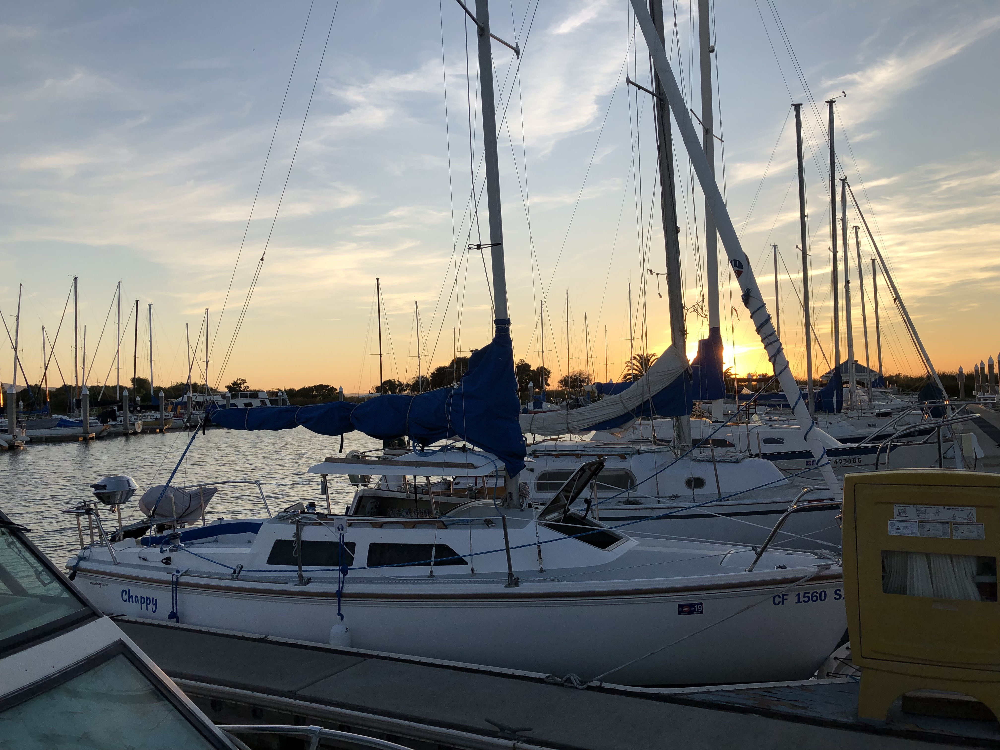

### Greetings :mask:

#### Personal life
:family: I'm a married father of two sons and a daughter.
I've always cycled through many hobbies; the latest being:
- :sailboat: Sailing and working on our [Catalina 22](http://sailingmagazine.net/article-1720-catalina-22.html)
- Lifting weights. I have a great home gym.
- Bike riding. I have a [new gravel bike](https://nsbikeusa.com/products/rag-2)
- Homebrew, ocean fishing, windsurfing, wakeboarding, motorcycling were prior passions

#### Work life
:factory: I’m currently working from home at [EllieMae](https://www.elliemae.com) as a Staff Engineer in the Cloud Operations Observability team.

  I've been there over a year after getting awarded an early retirement :bank: from SAP/Ariba.
  
  Prehistoric roles were at Callidus Cloud, Sun Microsystems, Trimble Navigation and Lockheed Missiles and Space; always as a Software Developer for Operation, DevOps, Platform teams. I gradulated from [UCSD](https://ucsd.edu), Computer Engineering over thrity years ago.
  
  Currently, I develop custom [Elastic Beats](https://www.elastic.co/beats) to ship application log data to Elastic clusters. My workday is mostly spent using :
- [GO](https://golang.org)
- [Ansible](https://github.com/ansible/ansible)
- [Jenkins](https://www.jenkins.io)
- [Git](https://git-scm.com) and [Github](https://github.com)

<!--
**richard-mauri/richard-mauri** is a ✨ _special_ ✨ repository because its `README.md` (this file) appears on your GitHub profile.

Here are some ideas to get you started:

- 🔭 I’m currently working on ...
- 🌱 I’m currently learning ...
- 👯 I’m looking to collaborate on ...
- 🤔 I’m looking for help with ...
- 💬 Ask me about ...
- 📫 How to reach me: ...
- 😄 Pronouns: ...
- ⚡ Fun fact: ...
-->
